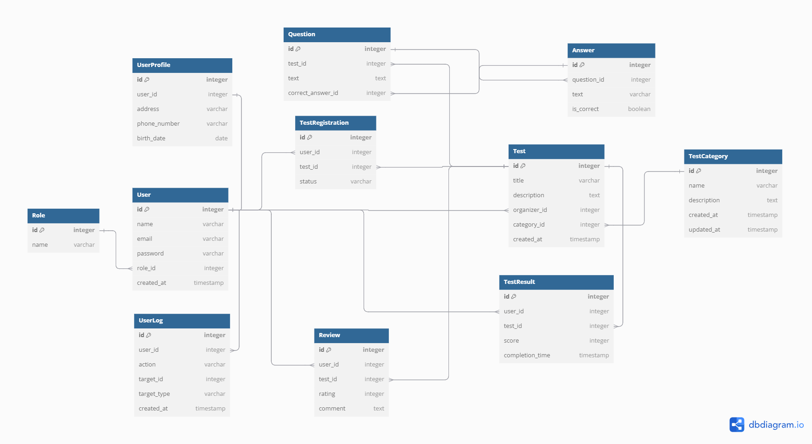

# МОДЕЛИ ДАННЫХ и СИСТЕМЫ УПРАВЛЕНИЯ БАЗАМИ ДАННЫХ

Платформа предназначена для создания и проведения онлайн-тестов для проверки знаний. В системе предусмотрены две роли: организатор и участник. Организаторы могут создавать тесты, добавлять вопросы и варианты ответов, а участники регистрируются, проходят тесты и получают результаты. Система также включает отзывы и статистику, что позволяет анализировать результаты тестирования и управлять образовательным процессом.

## Автор

 Станишевский Александр Дмитриевич, группа 253505

## Тема разрабатываемого проекта
Платформа для проверки знаний через тестирование
## Функциональные требования
- Регистрация и авторизация пользователей (две роли: участник и организатор)
- Создание и управление тестами организаторами.
- Добавление и редактирование вопросов и вариантов ответов к тестам
- Регистрация участников на тесты
- Прохождение тестов участниками
- Отображение результатов тестирования для участников
- Отображение статистики по результатам участников для организаторов
- Личный кабинет участников с историей тестов и результатами
- Отзывы участников о тестах
## Перечень сущностей БД
    1. Пользователь (User) — общий список всех пользователей (участников и организаторов)
    2. Роль (Role) — две роли: участник и организатор
    3. Тест (Test) — тест, созданный организатором для проверки знаний участников
    4. Категория теста (TestCategory) — категория, к которой относится тест
    5. Вопрос (Question) — вопросы, входящие в тест
    6. Ответ (Answer) — варианты ответов на каждый вопрос
    7. Результат теста (TestResult) — результаты тестирования участников
    8. Регистрация на тест (TestRegistration) — связь между участниками и тестами
    9. Отзыв (Review) — отзывы участников о тестах
    10. Профиль пользователя (UserProfile) — профиль, с информацией о пользователе
    11. UserLog - журнал дейсвий пользователя
## Схема БД

## Описание сущностей
1. User (Пользователь):
- id (int, PK, auto-increment) — уникальный идентификатор пользователя
- name (varchar, not null) — имя пользователя
- email (varchar, unique, not null) — электронная почта
- password (varchar, not null) — пароль
- role_id (int, FK) — идентификатор роли
- created_at (timestamp, not null) — дата регистрации
  
2. Role (Роль):
- id (int, PK, auto-increment) — уникальный идентификатор роли
- name (varchar, not null) — название роли
  
3. Test (Тест):
- id (int, PK, auto-increment) — уникальный идентификатор теста
- title (varchar, not null) — название теста
- description (text) — описание теста
- organizer_id (int, FK) — организатор теста
- category_id (int, FK) — идентификатор категории теста 
- created_at (timestamp, not null) — дата создания теста
  
4. TestCategory (Категория теста):
- id (int, PK, auto-increment) — уникальный идентификатор категории
- name (varchar, not null) — название категории 
- description (text) — описание категории, которое дает больше информации о содержании тестов в данной категории
- created_at (timestamp, not null) — дата создания категории
- updated_at (timestamp) — дата последнего обновления категории
  
5. Question (Вопрос):
- id (int, PK, auto-increment) — уникальный идентификатор вопроса
- test_id (int, FK) — тест, к которому относится вопрос
- text (text, not null) — текст вопроса
- correct_answer_id (int, FK) — правильный ответ
  
6. Answer (Ответ):
- id (int, PK, auto-increment) — уникальный идентификатор ответа
- question_id (int, FK) — вопрос, к которому относится этот ответ
- text (varchar, not null) — текст ответа.
- is_correct (boolean, not null) — флаг, правильный ли ответ
  
7. TestResult (Результат теста):
- id (int, PK, auto-increment) — уникальный идентификатор результата
- user_id (int, FK) — участник, завершивший тест
- test_id (int, FK) — тест, который был завершён
- score (int, not null) — количество набранных баллов
- completion_time (timestamp, not null) — время завершения теста
  
8. TestRegistration (Регистрация на тест):
- id (int, PK, auto-increment) — уникальный идентификатор регистрации
- user_id (int, FK) — участник, зарегистрировавшийся на тест
- test_id (int, FK) — тест, на который зарегистрировался участник
- status (varchar, not null) — статус участия
  
9. Review (Отзыв):
- id (int, PK, auto-increment) — уникальный идентификатор отзыва
- user_id (int, FK) — участник, оставивший отзыв
- test_id (int, FK) — тест, к которому относится отзыв
- rating (int, not null) — оценка теста (от 1 до 5)
- comment (text) — комментарий участника
  
10. UserProfile (Профиль):
- id (int, PK, auto-increment) — уникальный идентификатор профиля пользователя
- user_id (int, FK, unique, not null) — уникальный идентификатор пользователя, к которому привязан профиль
- address (varchar) — адрес пользователя
- phone_number (varchar) — номер телефона пользователя
- birth_date (date) — дата рождения пользователя

11. UserLog
- id: уникальный идентификатор записи лога.
- user_id: ID пользователя, который выполнил действие.
- action: тип действия (например, "create", "update", "delete", "login").
- target_id: ID цели действия 
- target_type: тип сущности, на которую направлено действие (например, "Test", "Question", "Review").
- created_at: время выполнения действия.
## Виды связей между сущностями
User (Пользователь)

- Many-to-One с Role (Роль) — каждый пользователь имеет одну роль
- One-to-Many с Test (Тест) — один пользователь может быть организатором множества тестов
- One-to-Many с Review (Отзыв) — один пользователь может оставить множество отзывов
- One-to-Many с TestResult (Результат теста) — один пользователь может завершить множество тестов
- One-to-Many с TestRegistration (Регистрация на тест) — один пользователь может зарегистрироваться на множество тестов
Role (Роль)

- One-to-Many с User (Пользователь) — одна роль может быть назначена множеству пользователей
Test (Тест)

- Many-to-One с User (Пользователь) — каждый тест имеет одного организатора
- Many-to-One с TestCategory (Категория теста) — каждый тест относится к одной категории
- One-to-Many с Question (Вопрос) — один тест может содержать множество вопросов
- One-to-Many с TestResult (Результат теста) — один тест может иметь множество результатов
- One-to-Many с TestRegistration (Регистрация на тест) — один тест может быть зарегистрирован множеством участников
- One-to-Many с Review (Отзыв) — один тест может иметь множество отзывов

TestCategory (Категория теста)

- One-to-Many с Test (Тест) — одна категория может включать множество тестов
Question (Вопрос)

- Many-to-One с Test (Тест) — каждый вопрос относится к одному тесту
- One-to-Many с Answer (Ответ) — один вопрос может иметь множество вариантов ответов
Answer (Ответ)

- Many-to-One с Question (Вопрос) — каждый ответ относится к одному вопросу
TestResult (Результат теста)

- Many-to-One с User (Пользователь) — каждый результат принадлежит одному участнику
- Many-to-One с Test (Тест) — каждый результат связан с одним тестом
TestRegistration (Регистрация на тест)

- Many-to-One с User (Пользователь) — каждая регистрация принадлежит одному участнику
- Many-to-One с Test (Тест) — каждая регистрация относится к одному тесту
Review (Отзыв)

- Many-to-One с User (Пользователь) — каждый отзыв принадлежит одному участнику
- Many-to-One с Test (Тест) — каждый отзыв относится к одному тесту
 
UserProfile (Профиль пользователя)
- One-to-One с User (Пользователь) — у одного пользователя один профиль 
